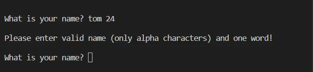
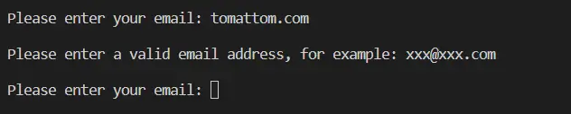
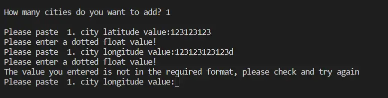
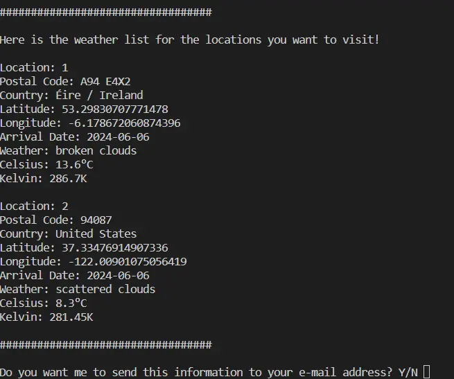

<h1>Weather Checker</h1>

Maybe it's a business trip or a vacation trip or a picnic trip, if you are traveling somewhere and want to know the weather forecast of your destination. Weather Checker will help you. What's more, you can send this information to your email address or a friend's email address!

All you have to do is specify the locations you want to go to. Weather Checker will do everything else for you with its user-friendly screens. The locations you want to go to are easily and safely determined thanks to the Google Maps infrastructure. You get real information thanks to Openweather api support. 

<h1 style="color:red;"> Live link here</h1>

<h2> How to Use </h2>

<ul>
<li>The user must have an email address to receive reports.</li>
<li>The user needs to set the targets (latitude and longitude).</li>
<li>The user must specify the date of departure.</li>
</ul>

<h2>Site Owners Goal</h2>

<ul>
<li>To enable its users to easily access the information they want.</li>
<li>Providing users with an easy-to-use application.</li>
</ul>

<h2>User Benefits</h2>

This program significantly simplifies travel planning for users. They can better plan their travel dates and destinations by getting weather information while determining the route they will travel. In this way, they can take precautions against adverse weather conditions they may encounter while traveling and make their travel experience more enjoyable.

In addition, this program helps users determine their travel routes. Users can identify the cities they want to visit and the activities they will do in those cities. Using weather information, they can plan which activities are more suitable for the dates they will be traveling and what kind of clothes they should wear.

The program helps users save time and resources. They can create their travel routes on a single platform, without the need for external weather apps or websites. This allows users to make travel plans more efficiently and prevents unnecessary time wastage.

Users receive personalized services through the program. They can easily manage their travel plans by receiving travel route and weather information via email. This helps users keep their travel plans updated and makes their travel experience smoother.

<h2>Logic Flow</h2>

Starting to design my project with a flowchart has helped me a lot. First, these diagrams helped me understand my code better and simplify complex logic. The flow of logic with visually represented figures helped me to see the operations more clearly and better understand how the code works. Secondly, the flowcharts made it easier for me to identify potential error points and get through the debugging process more easily.

**There may be some differences because I drew the flowchart before I started my project.**

## Features

### Welcome Section

When the user enters the application they are greeted with a very simple page welcoming them to the game and asking them for their name. The welcome text was created using Pyfiglet which takes ASCII text and renders it into ASCII art fonts.

### Name Validation

User name entry has strong data validation. The user cannot enter a name with numbers or spaces in it. If they do not enter valid data, the message "Please enter valid name (only alpha characters) and one word!" is displayed.   

### Email Validation

Once the user has entered their name correctly, they are asked to enter their email address.

The email address entered by the user is checked with a regex structure. In case the mail expression is incorrect, the user will be asked to enter this data again.

When you enter your name and email address correctly, the user object will be created and then it will continue its process. 

### Maps Help Section

After the user has provided the required information, he/she has to report his/her location in order to get the weather information of the destination, which is the main purpose of the program. If he/she does not have this information, we provide information on how to access this information. If he indicates that he would like to get help: 

If the user asks for help, an explanation of how to use the Google Maps service and a link to help will be displayed.

### Add location

If the user does not ask for help, the program will ask how many cities they would like to receive a report about.

At this point we expect our user to specify how many cities to add with a number. And of course we need to check the entered expression. If it is entered incorrectly: 

As many locations as the user enters, it is requested to enter latitude and longitude information first, respectively.

The entered coordinate information is queried with the api service of Geopy service and the registered address information is displayed to the user.

If the user thinks that the address information is incorrect, he/she can type N and re-enter the information or Y to continue the program execution. If the user has specified that he/she wants to go to more than one location, the coordinate information of all cities and the date to be traveled are asked on this screen. 

### Added Trip Date

After entering the location information, the travel date must be entered. 

### Summary Screen

Once all the information has been entered, the user will be presented with a summary screen as follows. ***Addresses are shown in full as they vary by country.***

### Report Screen

The user is asked if they want the information by mail. If the user wants to receive the information by e-mail, it will be sent to the e-mail address they have typed. 

### Mail Report

The report e-mail sent to the e-mail address entered in the system is as follows. 

## Data Model

I used principles of Object-Oriented Programming throughout this project. The Word-Py game consists of three classes:

- person.py
- location.py
- tools.py

The `Person.py` object is created to store the user's personal information. It has two variables that hold the name to address the user and the e-mail address to send weather reports if desired. 

The `Location.py` object is an object created to hold the information of the destination. It contains the postal code, country, alias, latitude, longitude, arrival date, weather, degrees Celsius and kelvin.

The `Tools.py` object is the data center that collects the data received and displayed from the user and the necessary operations that communicate between the Apis and the application. 

When the program runs, it takes the user's name and email information. With this information, it creates an object named Person and assigns values to the relevant fields. 

It inquires whether the user has information about the latitude and longitude of the locations to which they may be traveling. If necessary, it provides information.

In the next step, the user is asked how many locations they want to check and is asked to enter the information (latitude and longitude) according to the answer given. Once these two pieces of information are entered, a method object is used to create a Location object with the information from the Geopy API, assign values to it and show it to the user to verify that the location is where they want to go. If the user confirms the information, the location is added to an array. 

Date information to go to the location is requested. Since Openweather's API requests date information in Unix date format, the data is converted with datetime library. 

With the converted date information, latitude and longitude information, queries are made through the Openweather API and the results are matched to the relevant fields in the location object. 

This data is shown to the user after completing the steps for all relevant locations. If this data is to be sent as an e-mail, it is ensured that it is sent with the relevant methods in the email library and TLS security. 

## Testing

### PEP8 Testing

The python files have all been passed through [PEP8 Online](https://www.pythonchecker.com/). All python files were checked with no errors reported. See screen show below:

main.py

person.py

location.py

tools.py

### Input Testing

At every point where a user enters data, the data entered is checked:

- What is your name? : The user can enter string data consisting of only one word with no numeric characters and without space.

- Please enter your email: This field is tested by checking the mail address format with the regex structure.

- How many cities do you want to add? Only numeric characters can be entered in this field.

- Please paste  x. city latitude value: Expressions with a dot(.) character in this field are allowed and can be converted to float.

- Please paste  x. city longitude value: Expressions with a dot(.) character in this field are allowed and can be converted to float.

All of the above tests were completed in my local terminal and also in the Heroku terminal.

## Libraries and Technologies Used

### Python Libraries

[pyfiglet](https://pypi.org/project/pyfiglet/) - for taking ASCII text and rendering it into ASCII art fonts.

[requests]() - Requests is an HTTP library, written in Python, for human beings.

[smtplib]() - SMTP/ESMTP client class.

[geopy](https://pypi.org/project/geopy) - geopy is a Python client for several popular geocoding web services.

[datetime]() - Date time converter

### Programs Used

[GitHub](https://www.github.com) - used for version control.
[Heroku](https://id.heroku.com/login) - used to deploy the live project.
[Lucidchart](https://www.lucidchart.com/pages) - used to create the game flowchart
[PEP8 Checker](https://www.pythonchecker.com/) - used to validate all the Python code

## Creadits

### Resources Used

[W3Schools](https://www.w3schools.com/)
[Stack Overflow](https://stackoverflow.com/)
[Code Academy](https://www.codecademy.com/resources/docs/python/strings/isalpha) I got help on how to use the isalpha method
[geeksforgeeks](https://www.geeksforgeeks.org/re-fullmatch-function-in-python/) - Regex and fullmatch usage
[pyfiglet](https://pypi.org/project/pyfiglet/) I used it for the big ASCI welcome text on the input screen.

## Deployment

The site was deployed via Heroku, and the live link can be found here: Word-Py

Before deploying to Heroku pip3 freeze > requirements.txt was used to add all the dependencies required to the requirements.txt file. This is required for the game to run on Heroku.

The following steps were then taken:

<ol>
<li>Log in to Heroku or create an account.</li>
<li>On the main page click the button labelled New in the top right corner and from the drop-down menu select "Create New App".</li>
<li>Enter a unique and meaningful app name.</li>
<li>Next select your region.</li>
<li>Click on the Create App button.</li>
<li>Click on the Settings Tab and scroll down to Config Vars.</li>
<li>Click Reveal Config Vars and enter port into the Key box and 8000 into the Value box and click the Add button.</li>
<li>Input CREDS and the content of your Google Sheet API creds file as another config var and click add.</li>
<li>In the next Key box enter OXFORD_API_APP_ID and add your unique ID to the value box.</li>
<li>In the next Key box enter OXFORD_API_APP_KEY and add your unique key to the value box.</li>
<li>Next, scroll down to the Buildpack section click Add Buildpack select Python and click Save Changes</li>
<li>Repeat step 11 to add node.js. Note: The Buildpacks must be in the correct order. If not click and drag them to move into the correct order.</li>
<li>Scroll to the top of the page and choose the Deploy tab.</li>
<li>Select Github as the deployment method.</li>
<li>Confirm you want to connect to GitHub.</li>
<li>Search for the repository name and click the connect button.</li>
<li>Scroll to the bottom of the deploy page and either click Enable Automatic Deploys for automatic deploys or Deploy Branch to deploy manually. Manually deployed branches will need re-deploying each time the repo is updated.</li>
<li>Click View to view the deployed site.</li>
</ol>

The site is now live and operational.

## Acknowledgments
The Code Institute slack community for their quick responses and very helpful feedback!

Many thanks to the user [AliOKeeffe](https://github.com/AliOKeeffe/word-Py?tab=readme-ov-file), whose resources I have used extensively during the preparation of this file.